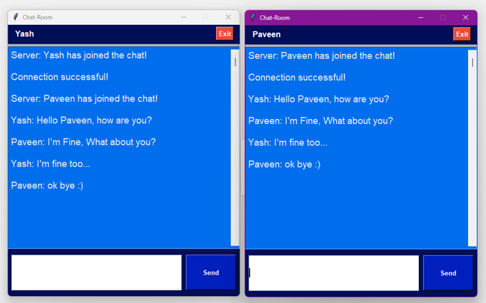
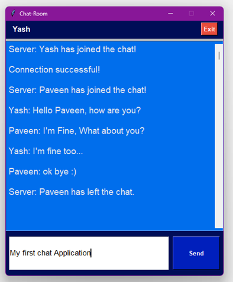
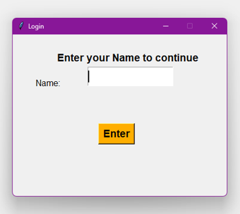

# Python_Internship_VaulOfCodes

## Chat Application Using Python :


### Introduction :
This project is a chat application built using Python. The application implements a client-server model and features a graphical user interface (GUI) using the Tkinter library.

### Working :
1. The server starts and listens for incoming connections.
2. Clients connect to the server, provide a username, and join the chat room.
3. Clients can send and receive messages in real-time.
4. Clients can exit the chat, and the server notifies other users.

### Features :
- Real-time communication

  
  
- GUI for ease of use
- Multiple clients support
- Notification when a user joins or exits the chat

  

## How to Run :

### Server :
1. Ensure Python is installed on your machine.
2. Run the `server.py` script to start the server.
    ```bash
    python server.py
    ```

    

### Client :
1. Ensure Python is installed on your machine.
2. Run the `client.py` script to start the client.
    ```bash
    python client.py
    ```

    
    
3. Enter your name in the login window and click "Enter".

    
    
4. Start chatting!

    

## Dependencies :
- Python 3.x
- Tkinter (included with Python)
- socket (included with Python)
- threading (included with Python)

## File Structure : 
- `client.py`: Client-side script for the chat application.
- `server.py`: Server-side script for the chat application.
- `chat.py`: Contains helper functions for formatting and validating messages.

### Have A Good Day :)
